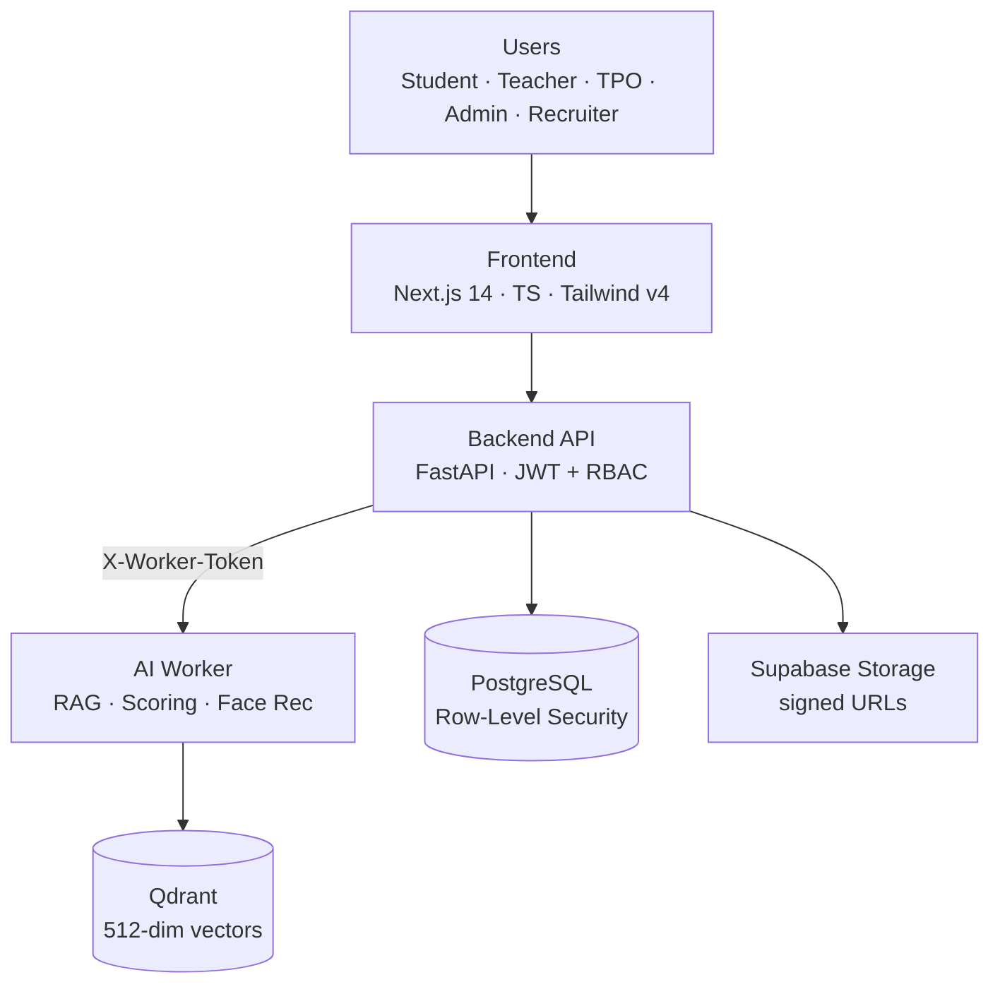

# 🎓 Campus AI

> _From the first check-in to the final offer letter._

A production-grade **multi-tenant campus operating system** that unifies academics, attendance,
placements, and an AI mentor into one role-aware workspace — built on **FastAPI + Next.js** with a
strict **verified-data, no-hallucination** design.

[](https://github.com/Vishal-AI-ML/campus-ai/actions/workflows/ci.yml)


### 🌐 Live demo

- **Frontend:** https://campus-ai-eta.vercel.app
- **API:** https://campus-ai-backend-ez7m.onrender.com
- **AI worker:** https://vishalaigenai-campus-ai-worker.hf.space

> ⚠️ The backend runs on a free tier and sleeps when idle — the **first request may take ~30–50s** to warm up.

---

## 📑 Table of contents

- [Why](#-why)
- [What](#-what)
- [How](#-how)
- [AI / ML engineering](#-ai--ml-engineering)
- [Tech stack](#-tech-stack)
- [Project structure](#-project-structure)
- [Getting started](#-getting-started)
- [Environment variables](#-environment-variables)
- [Security & multi-tenancy](#-security--multi-tenancy)
- [Engineering quality](#-engineering-quality)
- [Deployment](#-deployment)
- [Roadmap](#-roadmap)
- [License](#-license)

---

## 🤔 Why

Most colleges run on a tangle of spreadsheets, disconnected portals, and WhatsApp groups. The cost of that mess is real:

- **Data lives in silos** — attendance, marks, placements, and mentoring never talk to each other.
- **Career advice is generic** — students get tips with no link to their actual academic footprint.
- **Placement cells fly blind** — drives managed over email and sheets, with no audit trail.
- **Tenancy is an afterthought** — most tools bolt on multi-tenancy late, leaking data across institutes.

Campus AI is built around one idea: a **verified data moat**. Every academic and placement signal is
captured at source and tenant-isolated, so the AI reasons over trustworthy data instead of
self-reported claims — _it would rather cite a verified record than invent one._

## 📦 What

One role-aware platform where each user gets exactly the surface they need:

| Role | Key capabilities |
|------|------------------|
| 🧑‍🎓 **Student** | Attendance & academics dashboard, resume + ATS score, AI mentor, internships/placements, projects, doubts, leave/OD requests |
| 👩‍🏫 **Teacher** | Photo-based face attendance, gradebook, assignments, doubt resolution, proof verification, timetable |
| 🎯 **TPO** | Drives, applications pipeline, recruiter management, placement analytics |
| 🛠️ **Admin** | Institute setup, users & departments, calendar, announcements, audit log, analytics |
| 🏢 **Recruiter** | Post drives, review verified candidate profiles, shortlist |

**Highlights**

- 🎯 **Verified data moat** — the AI mentor answers grounded in the student's real, verified record (CGPA, attendance, skills), not self-reported claims.
- 📸 **Face attendance** — mark a whole section from a single classroom photo, backed by vector search.
- 🔐 **True multi-tenancy** — isolation enforced at the database layer via Postgres Row-Level Security.
- ⚡ **AI without blocking** — heavy inference runs in a separate worker and as background tasks.
- 🛡️ **Secure by default** — JWT + RBAC, signed-URL uploads, secrets from env only, audit logging.

## 🏗️ How



**How a face-attendance request flows**

1. A teacher submits a classroom photo to the backend (JWT-authenticated, **teacher/admin only** via RBAC).
2. The backend gates the upload before anything else — **size cap + image magic-byte sniffing** (`validate_base64_image`) rejects non-images and oversized payloads.
3. The backend forwards the image to the **AI worker** over HTTP with a shared `X-Worker-Token` secret.
4. The worker computes face embeddings and queries **Qdrant** (`student_faces`, 512-dim cosine) for matches against enrolled students, flagging **outsiders**.
5. Matches return with confidence; the teacher confirms, and records persist in **PostgreSQL** — every write filtered by **Row-Level Security** for the tenant.

**Design principles**

- **Modular monolith** backend — one FastAPI app split into domain modules (auth, academics, attendance, placements, doubts, timetable, leave, analytics, audit, files).
- **Separate AI worker** — model calls, vector search, and heavy inference stay isolated from the transactional API so each can scale independently; the public worker only answers this backend (token-gated).
- **Direct browser ↔ storage** uploads via short-lived signed URLs — the backend signs, never proxies file bytes.

## 🤖 AI / ML engineering

The AI work lives in a dedicated **`ai-worker`** microservice (FastAPI).

### RAG mentor
- Retrieval-augmented mentor grounded in the student's **verified profile** — not hallucinated generic advice.
- Prompt templates assembled from structured records, with guardrails around what the model may claim.

### Resume & ATS scoring
- Automated resume scoring returning an ATS-style score and improvement signals.
- Runs as a **background task** — the API responds immediately and fills `ai_score` asynchronously.

### Face-recognition attendance
- Face embeddings in **Qdrant** (`student_faces`, **512-dim cosine**), matched against enrolled students with outsider detection.
- Upload validation (size cap + magic bytes) before any inference.

### Evaluation & observability
- **Langfuse** tracing across worker calls for latency/quality visibility.
- A lightweight **AI eval harness** to sanity-check model outputs on a fixed profile before shipping worker changes.

## 🧱 Tech stack

| Layer | Technology |
|-------|------------|
| **Frontend** | Next.js 14 (App Router), TypeScript, Tailwind CSS v4, light/dark themes |
| **Backend** | FastAPI, Python 3.13, Pydantic, SQLAlchemy, Alembic |
| **AI worker** | FastAPI, RAG mentor, resume scoring, face recognition, Langfuse |
| **Data** | PostgreSQL (RLS), Qdrant (512-dim cosine), Supabase Storage |
| **Auth** | JWT, role-based access control (5 roles) |
| **Tooling** | uv, npm, Ruff, pytest, GitHub Actions CI, Playwright |
| **Hosting** | Vercel (frontend) · Render (API) · Hugging Face Spaces (worker) |

## 📁 Project structure

```
campus-ai/
├── backend/           # FastAPI core API
│   ├── main.py            # app entrypoint, router mounting
│   ├── models.py          # SQLAlchemy models (multi-tenant, RLS)
│   ├── schemas.py         # Pydantic request/response schemas
│   ├── security.py        # JWT, RBAC, password hashing
│   ├── attendance.py      # attendance + face-attendance routes
│   ├── files.py           # signed-URL upload/download flow
│   ├── uploads.py         # image validation (size + magic bytes)
│   ├── ai_client.py       # talks to the AI worker (X-Worker-Token)
│   ├── alembic/           # database migrations (RLS policies included)
│   └── tests/             # pytest suite (hermetic)
├── ai-worker/         # FastAPI AI microservice
│   └── ...                # RAG mentor, resume scoring, face recognition
├── frontend/          # Next.js 14 dashboard + marketing site
│   └── src/app/           # App Router pages (role-based dashboards)
└── .github/workflows/ # CI (Ruff lint + pytest)
```

## 🚀 Getting started

### Prerequisites

- Python 3.13 + [uv](https://github.com/astral-sh/uv)
- Node.js 18+ and npm
- PostgreSQL
- Qdrant (required for face recognition and RAG features)

### Backend

```bash
cd backend
uv sync
uv run alembic upgrade head
uv run uvicorn main:app --reload --port 8000
```

Visit `http://localhost:8000/docs` for the interactive API.

### AI worker

```bash
cd ai-worker
uv sync
cp env.example .env      # fill in the values
uv run uvicorn main:app --reload --port 7860
```

### Frontend

```bash
cd frontend
npm install
cp .env.local.example .env.local   # set NEXT_PUBLIC_API_BASE_URL
npm run dev
```

Open `http://localhost:3000`.

### Tests & lint

```bash
cd backend
uv run ruff check .
uv run pytest -q
```

## 🔧 Environment variables

Secrets are **never committed** — copy the example files and fill them in:

```bash
# Backend (backend/.env)
DATABASE_URL=postgresql://...supabase.com:5432/postgres?sslmode=require
JWT_SECRET=...                      # python -c "import secrets; print(secrets.token_urlsafe(48))"
SUPABASE_URL=...                    # storage (optional; feature ships dark until set)
SUPABASE_SERVICE_KEY=...
SUPABASE_STORAGE_BUCKET=campus-uploads
AI_WORKER_URL=https://vishalaigenai-campus-ai-worker.hf.space
AI_WORKER_TOKEN=...                 # shared secret with the AI worker

# Frontend (frontend/.env.local)
NEXT_PUBLIC_API_BASE_URL=https://campus-ai-backend-ez7m.onrender.com
```

## 🔐 Security & multi-tenancy

- **Postgres Row-Level Security** enforces per-tenant isolation at the database layer — the app connects with a `NOBYPASSRLS` role so policies actually filter every query.
- **JWT + RBAC** with five distinct roles; every route is permission-gated.
- **Signed-URL file flow** with tenant-scoped storage paths and path-traversal protection; the feature ships dark (503) until storage env is configured.
- **Secrets from env only** — a startup gate refuses to boot in production on the dev JWT default or a token-less AI worker.
- **Audit log** for administrative actions.

## ✅ Engineering quality

- **Automated test suite** (pytest) covering auth, RBAC, rate-limits, tenant isolation, and the file-signing routes — with **hermetic tests** that never touch real Supabase.
- **GitHub Actions CI** runs Ruff lint + the full test suite on every push.
- **Alembic migrations** version the schema (RLS policies included) with a dedicated owner-role for DDL.
- **Clean Git hygiene** — enforced `.gitignore`, LF normalization, and a scrubbed history (no stray binaries or PII in the repo).

## 🌐 Deployment

| Component | Platform | URL |
|-----------|----------|-----|
| Frontend | Vercel | https://campus-ai-eta.vercel.app |
| Backend | Render | https://campus-ai-backend-ez7m.onrender.com |
| AI worker | Hugging Face Spaces | https://vishalaigenai-campus-ai-worker.hf.space |
| Database | Supabase (Postgres) + Qdrant | Managed |

## 🗺️ Roadmap

- [ ] Complete the face-attendance review UI (bulk confirm + corrections)
- [ ] Virus scanning on file uploads
- [ ] Deeper placement analytics & recruiter insights
- [ ] Expand the AI eval harness into regression gating in CI

## 📄 License

Proprietary — © Campus AI. All rights reserved.

---

_Built to be honest: it grounds every answer in verified campus data rather than inventing one._
