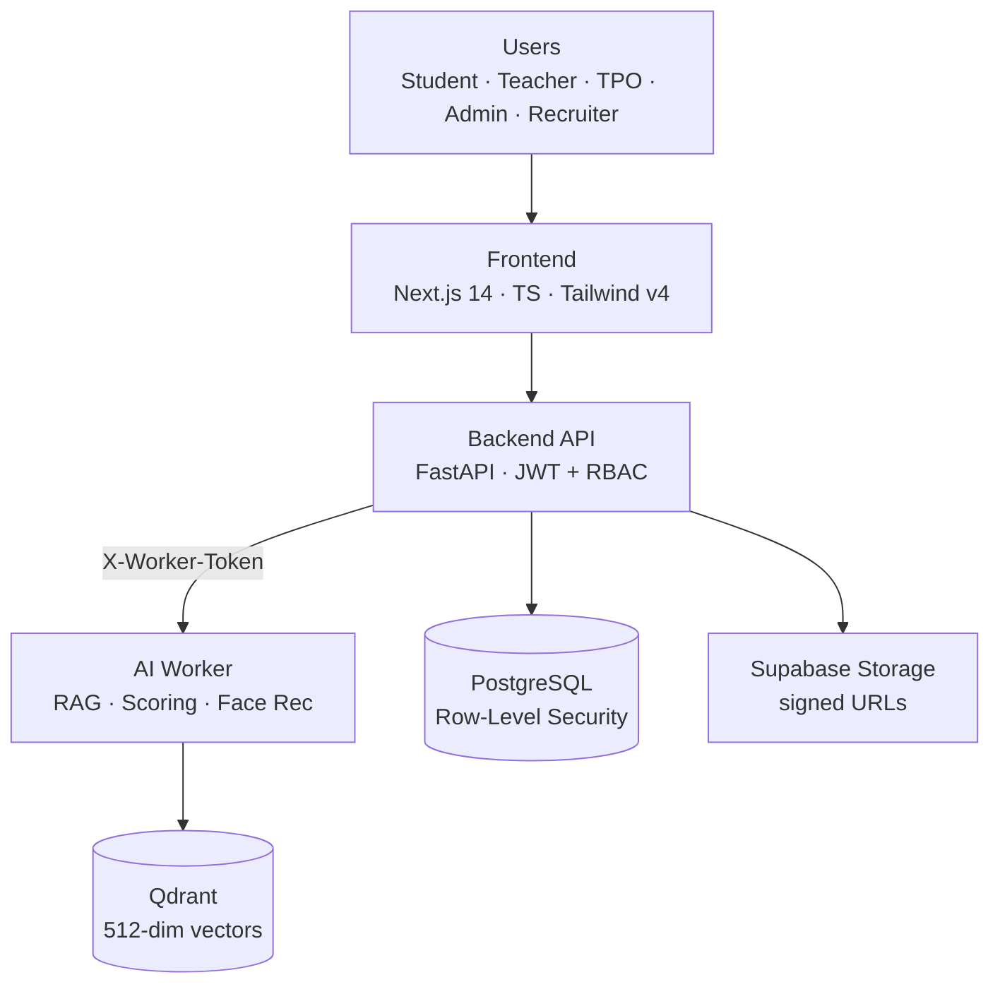

# 🎓 Campus AI

> _From the first check-in to the final offer letter._

[](https://github.com/Vishal-AI-ML/campus-ai/actions/workflows/ci.yml)


**🔗 Live demo:** https://campus-ai-eta.vercel.app

Campus AI is a **multi-tenant campus operating system** that unifies academics, attendance,
placements, and an AI mentor into one role-aware workspace for students, teachers, placement
officers (TPO), administrators, and recruiters.

The core differentiator is a **verified data moat**: every academic and placement signal is
captured at source and tenant-isolated, so the AI reasons over trustworthy data instead of
self-reported claims.

---

## 📑 Table of contents

- [The problem](#-the-problem)
- [What it does by role](#-what-it-does--by-role)
- [AI / ML engineering](#-ai--ml-engineering)
- [Architecture](#-architecture)
- [Tech stack](#-tech-stack)
- [Monorepo layout](#-monorepo-layout)
- [Getting started](#-getting-started)
- [Environment variables](#-environment-variables)
- [Security & multi-tenancy](#-security--multi-tenancy)
- [Engineering quality](#-engineering-quality)
- [Deployment](#-deployment)
- [Roadmap](#-roadmap)
- [License](#-license)

---

## 🎯 The problem

- Campus data lives in silos — attendance, marks, placements, and mentoring never talk to each other.
- Students get generic career advice with no link to their real academic footprint.
- Placement cells manage drives over email and spreadsheets, with no audit trail.
- Institutes need strict data isolation, but most tools bolt on multi-tenancy as an afterthought.

## 🧑‍🎓 What it does — by role

| Role | Key capabilities |
|------|------------------|
| **Student** | Attendance & academics dashboard, resume + ATS score, AI mentor, internships/placements, projects, doubts, leave/OD requests |
| **Teacher** | Photo-based face attendance, gradebook, assignments, doubt resolution, proof verification, timetable |
| **TPO** | Drives, applications pipeline, recruiter management, placement analytics |
| **Admin** | Institute setup, users & departments, calendar, announcements, audit log, analytics |
| **Recruiter** | Post drives, review verified candidate profiles, shortlist |

## 🤖 AI / ML engineering

The AI work lives in a dedicated **`ai-worker`** microservice (FastAPI) so model calls, vector
search, and heavy inference stay isolated from the transactional API and can scale independently.

### RAG mentor
- Retrieval-augmented mentor that answers grounded in the student's **verified profile**
  (CGPA, attendance, skills, projects) — not hallucinated generic advice.
- Prompt templates assembled from structured records, with guardrails around what the model may claim.

### Resume & ATS scoring
- Automated resume scoring pipeline returning an ATS-style score and improvement signals.
- Runs as a **background task** — the API responds immediately and fills `ai_score` asynchronously via the worker.

### Face-recognition attendance
- Teachers mark a whole section from a single classroom photo.
- Face embeddings stored in **Qdrant** (`student_faces`, **512-dim, cosine** similarity), matched
  against enrolled students, with outsider detection.
- Uploads are gated before they reach the worker: **size cap + image magic-byte sniffing**
  (`validate_base64_image`) to reject non-images and oversized payloads.

### Evaluation & observability
- **Langfuse** tracing across worker calls for latency/quality visibility.
- A lightweight **AI eval harness** to sanity-check model outputs on a fixed profile before shipping worker changes.

## 🏗️ Architecture



- **Modular monolith** backend: one FastAPI app split into domain modules (auth, academics,
  attendance, placements, doubts, timetable, leave, analytics, audit, files).
- **Separate AI worker** reached over HTTP with a shared `X-Worker-Token` secret so a public
  worker only answers this backend.
- **Direct browser ↔ storage** uploads via short-lived signed URLs — the backend signs, never proxies file bytes.

## 🧱 Tech stack

| Layer | Technology |
|-------|------------|
| **Frontend** | Next.js 14 (App Router), TypeScript, Tailwind CSS v4, light/dark themes |
| **Backend** | FastAPI, Python 3.13, Pydantic, SQLAlchemy, Alembic |
| **AI worker** | FastAPI, RAG mentor, resume scoring, face recognition, Langfuse |
| **Data** | PostgreSQL (RLS), Qdrant (512-dim cosine), Supabase Storage |
| **Auth** | JWT, role-based access control (5 roles) |
| **Tooling** | uv, npm, Ruff, pytest, GitHub Actions CI, Playwright |

## 🗂️ Monorepo layout

| Path | Stack | Description |
|------|-------|-------------|
| `backend/` | FastAPI · Python 3.13 · uv | Core REST API — auth, academics, attendance, placements, doubts, timetable, leave/OD, analytics, audit. PostgreSQL + Alembic, JWT + RBAC, row-level security. |
| `ai-worker/` | FastAPI · Python 3.13 · uv | AI microservice — RAG mentor, resume scoring, face recognition (Qdrant vector store). |
| `frontend/` | Next.js 14 · TypeScript · Tailwind v4 | Marketing site + role-based dashboard, with light/dark themes. |

## 🚀 Getting started

### Prerequisites

- Python 3.13 + [uv](https://github.com/astral-sh/uv)
- Node.js 18+ and npm
- PostgreSQL
- Qdrant (required for face recognition and RAG features)

### Backend

```bash
cd backend
uv sync
uv run alembic upgrade head
uv run uvicorn main:app --reload --port 8000
```

### AI worker

```bash
cd ai-worker
uv sync
cp env.example .env      # fill in the values
uv run uvicorn main:app --reload --port 7860
```

### Frontend

```bash
cd frontend
npm install
cp .env.local.example .env.local   # set NEXT_PUBLIC_API_BASE_URL
npm run dev
```

Open http://localhost:3000

### Tests & lint

```bash
cd backend
uv run ruff check .
uv run pytest -q
```

## 🔧 Environment variables

Secrets are **never committed**. Copy the provided example files and fill them in:

- `ai-worker/env.example` → `.env`
- `frontend/.env.local.example` → `.env.local` (`NEXT_PUBLIC_API_BASE_URL`)

## 🔐 Security & multi-tenancy

- **Postgres Row-Level Security** enforces per-tenant isolation at the database layer — the app
  connects with a `NOBYPASSRLS` role so policies actually filter every query.
- **JWT + RBAC** with five distinct roles; every route is permission-gated.
- **Signed-URL file flow** with tenant-scoped storage paths and path-traversal protection;
  the feature ships dark (503) until storage env is configured.
- **Secrets from env only** — a startup gate refuses to boot in production on the dev JWT default
  or a token-less AI worker.
- **Audit log** for administrative actions.

## ✅ Engineering quality

- **Automated test suite** (pytest) covering auth, RBAC, rate-limits, tenant isolation, and the
  file-signing routes — with **hermetic tests** that never touch real Supabase.
- **GitHub Actions CI** runs Ruff lint + the full test suite on every push.
- **Alembic migrations** version the schema (RLS policies included) with a dedicated owner-role for DDL.
- **Clean Git hygiene** — enforced `.gitignore`, LF normalization, and a scrubbed history
  (no stray binaries or PII in the repo).

## 🌐 Deployment

| Component | Platform | URL |
|-----------|----------|-----|
| Frontend | Vercel | https://campus-ai-eta.vercel.app |
| Backend | Render | https://campus-ai-backend-ez7m.onrender.com |
| AI worker | Hugging Face Spaces | https://vishalaigenai-campus-ai-worker.hf.space |
| Database | Supabase (Postgres) + Qdrant | Managed |

## 🗺️ Roadmap

- [ ] Complete the face-attendance review UI (bulk confirm + corrections)
- [ ] Virus scanning on file uploads
- [ ] Deeper placement analytics & recruiter insights
- [ ] Expand the AI eval harness into regression gating in CI

## 📄 License

Proprietary — © Campus AI. All rights reserved.
